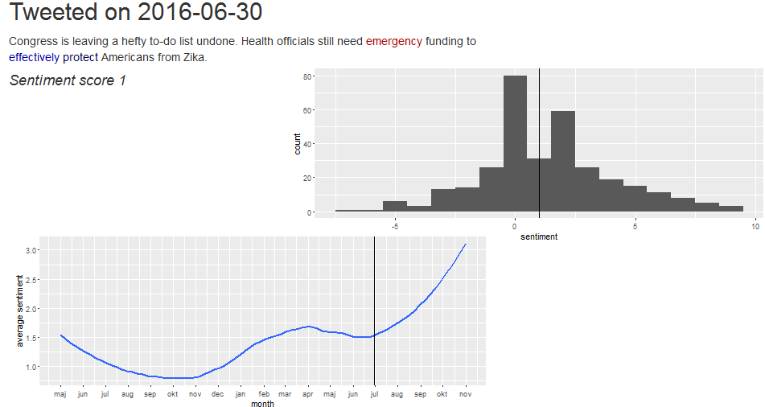

## The data set

On January 5th 2017, the Obama administration relased [their social media data](https://obamawhitehouse.archives.gov/blog/2017/01/05/new-lenses-first-social-media-presidency).


Among these data were all of the tweets the former president made from the `@POTUS` account.


[Dan Shiffman](https://www.youtube.com/channel/UCvjgXvBlbQiydffZU7m1_aw) cleaned up the text format slightly for the [Obamathon event at ITP - NYU](https://tisch.nyu.edu/itp/events/spring-2017/obamathon). This cleaned data - found [here](https://github.com/ITPNYU/Obamathon/blob/master/data/twitter_potus.json) - forms the basis for this project.


For the sentiment analysis, the [AFINN-111 data set](http://www2.imm.dtu.dk/pubdb/views/publication_details.php?id=6010) is used. It contains 2477 words which has been manually rated on a scale from -5 to 5.

## Finding the sentiment of single word

```{r, echo=FALSE}
afinn <- read.csv("AFINN-111.txt", sep = "\t", header = FALSE)
colnames(afinn) <- c("word", "score")
```

Regular expressions are used to find the word in the AFINN data and return sentiment:
```{r}
sentiment <- function(word) {
  lookup <- grep(paste0("^", word, "$"), afinn$word)
  if (length(lookup) == 0) {
    return(0)
  }
  afinn[lookup,]$score[1]
}

sapply(c("joy", "wrong", "dachshund"), sentiment)
```

## Inserting span for use with CSS

We want to use CSS for coloring words with non-zero sentiment:
```{r}
insert_sentiment_span <- function(string, word, sentiment) {
  capture <- paste0("(", word, ")")
  replacement <-
    paste0('<span class="sentiment',
           as.character(sentiment),
           '">\\1</span>')
  gsub(capture, replacement, string, ignore.case = TRUE)
}

insert_sentiment_span("Happy birthday!", "happy", 3)
```

## Putting it all together
This process is repeated to get a sentiment score for the tweet. It is then compared to the overall distribution of sentiments, and the average sentiment at the time of the tweet.

<center></center>
